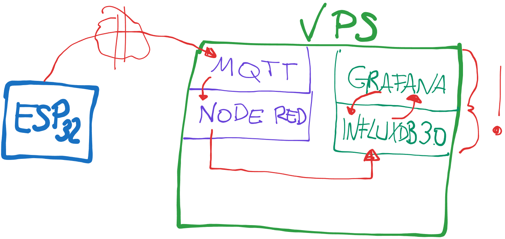

# Grafana + InfluxDB 3 + Node-RED



Kleines Setup für ein Zeitreihen-Stack mit **InfluxDB 3 Core** und **Grafana** via Docker.
Node-RED schreibt Messwerte direkt in die Datenbank.


Mein Video: https://youtu.be/eknrNxYTKTo

---

## 1. Docker Compose

`docker-compose.yml`

```yaml
services:
  influxdb:
    image: influxdb:3-core
    container_name: influxdb3
    ports:
      - "8181:8181"
    volumes:
      - influxdb3-data:/var/lib/influxdb3
    environment:
      - INFLUXDB3_NODE_IDENTIFIERS=local
    command: >
      serve
      --node-id local
      --object-store file
      --data-dir /var/lib/influxdb3
    restart: unless-stopped

  grafana:
    image: grafana/grafana:latest
    container_name: grafana
    ports:
      - "3000:3000"
    volumes:
      - grafana-data:/var/lib/grafana
    environment:
      - GF_SECURITY_ADMIN_PASSWORD=grafana2026
    restart: unless-stopped
    depends_on:
      - influxdb

volumes:
  influxdb3-data:
  grafana-data:
```

Starten:

```bash
docker compose up -d
```

---

## 2. InfluxDB 3 – Token & Database

Admin Token erstellen:

```bash
docker exec -it influxdb3 influxdb3 create token --admin
```

Database anlegen:

```bash
docker exec -it influxdb3 influxdb3 create database smarthome --token <DEIN_TOKEN>
```

---

## 3. Grafana

Aufruf:

```
http://localhost:3000
```

Login:

* User: `admin`
* Passwort: `admin`

Falls Login nicht funktioniert:

```bash
docker exec -it grafana grafana cli admin reset-admin-password neuespasswort123
```

Danach InfluxDB als Data Source einrichten
URL:

```
http://influxdb:8181
```

Token verwenden, Database: `smarthome`

---

## 4. Node-RED Flow

Dieser Flow erzeugt alle 5 Sekunden Zufallswerte und schreibt sie im Line Protocol Format in InfluxDB 3.

```json
[
    {
        "id": "7b4214274fe6fbbc",
        "type": "influxdb3-write",
        "z": "6097e498263590ed",
        "influxdb": "77dc3e018ab968df",
        "name": "",
        "measurement": "",
        "database": "smarthome",
        "x": 700,
        "y": 220,
        "wires": [
            [
                "914d3d2ae8e52ef2"
            ]
        ]
    },
    {
        "id": "fdecb5ac3af6fbbf",
        "type": "inject",
        "z": "6097e498263590ed",
        "name": "",
        "props": [
            {
                "p": "payload"
            },
            {
                "p": "topic",
                "vt": "str"
            }
        ],
        "repeat": "5",
        "crontab": "",
        "once": false,
        "onceDelay": 0.1,
        "topic": "",
        "payload": "",
        "payloadType": "date",
        "x": 330,
        "y": 220,
        "wires": [
            [
                "8421b2828a3de5da"
            ]
        ]
    },
    {
        "id": "914d3d2ae8e52ef2",
        "type": "debug",
        "z": "6097e498263590ed",
        "name": "debug",
        "active": true,
        "tosidebar": true,
        "console": false,
        "tostatus": false,
        "complete": "false",
        "statusVal": "",
        "statusType": "auto",
        "x": 860,
        "y": 220,
        "wires": []
    },
    {
        "id": "8421b2828a3de5da",
        "type": "function",
        "z": "6097e498263590ed",
        "name": "random Werte",
        "func": "const temp = (Math.random() * 10 + 18).toFixed(1);\nconst humidity = (Math.random() * 20 + 55).toFixed(1);\n\nmsg.payload = `sensors,location=room1 temperature=${temp},humidity=${humidity}`;\nreturn msg;",
        "outputs": 1,
        "timeout": 0,
        "noerr": 0,
        "initialize": "",
        "finalize": "",
        "libs": [],
        "x": 500,
        "y": 220,
        "wires": [
            [
                "7b4214274fe6fbbc"
            ]
        ]
    },
    {
        "id": "77dc3e018ab968df",
        "type": "influxdb3-config",
        "name": "influxdb",
        "host": "http://65.21.105.35:8181",
        "database": "smarthome",
        "tlsRejectUnauthorized": false,
        "caCertPath": ""
    }
]
```

---

## Ergebnis

* InfluxDB 3 speichert Zeitreihen
* Node-RED schreibt Daten
* Grafana visualisiert alles

Fertig für Smarthome, Sensoren oder beliebige IoT Daten.

